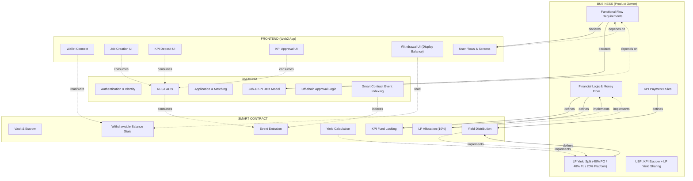
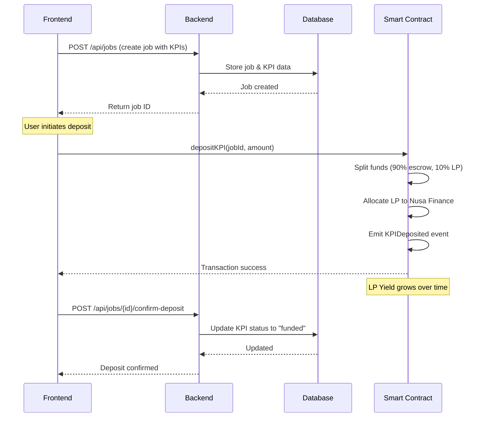
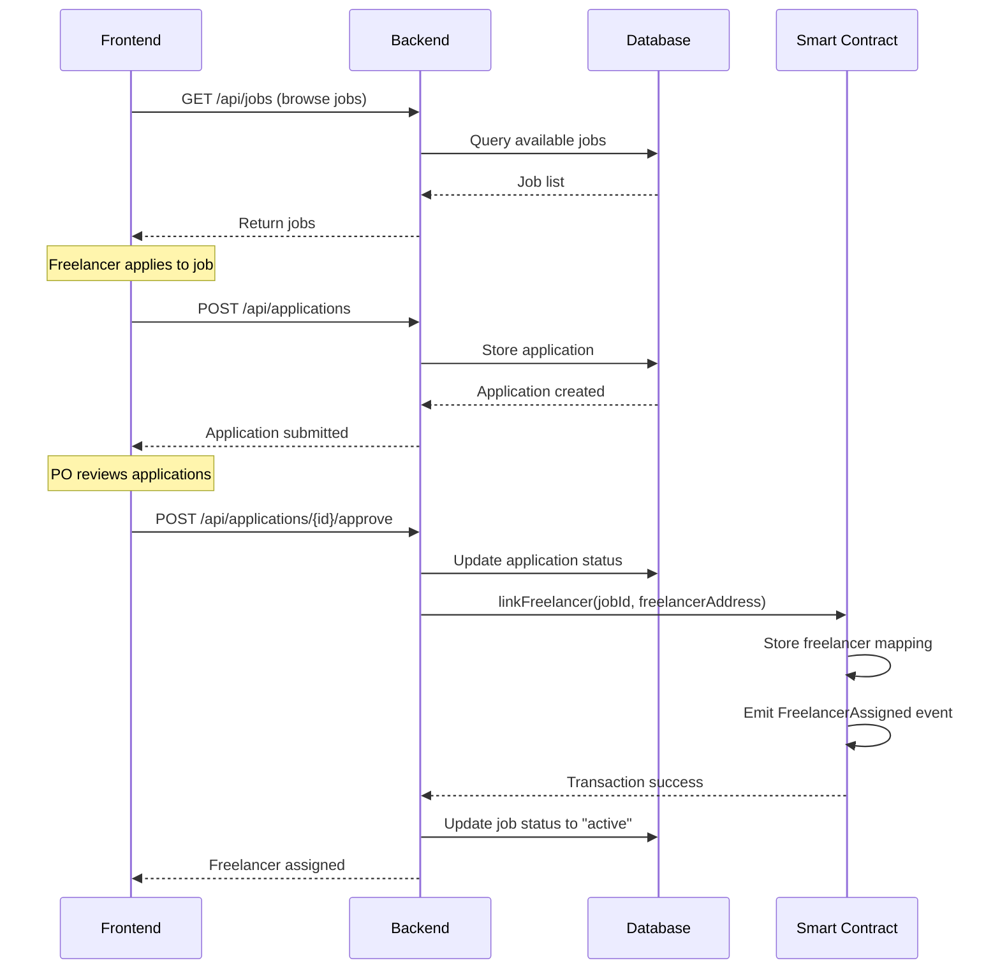
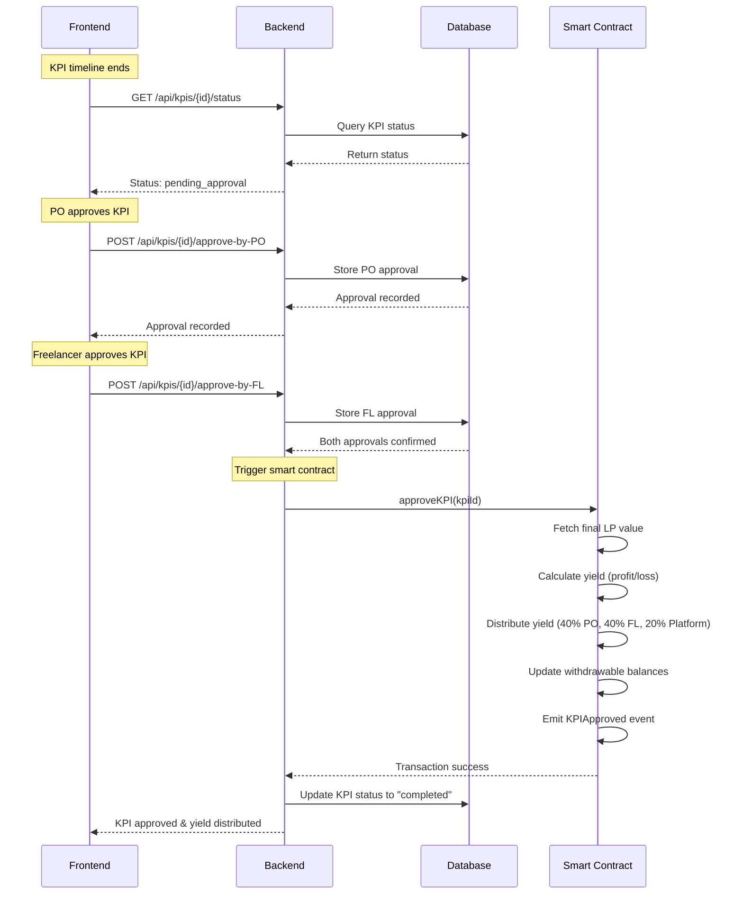
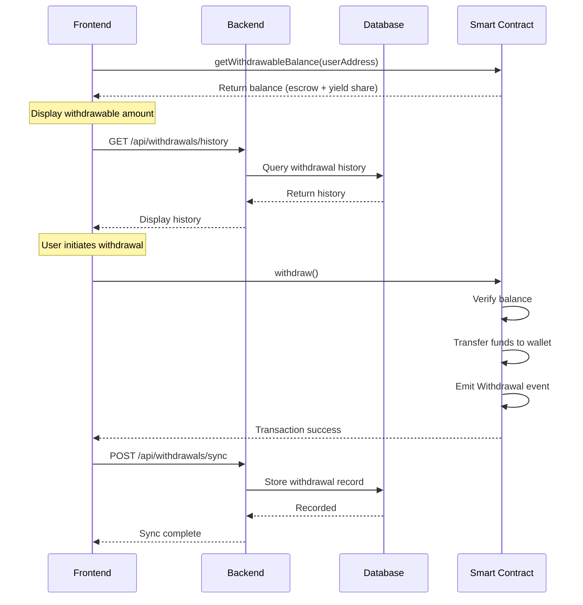

# NovaLance Architecture

## Overview

High-level architecture diagram showing responsibilities, dependencies, and handoffs between the 4 core roles in the NovaLance platform.

## Architecture Diagram

## Legend

| Arrow Type | Meaning |
|------------|---------|
| `-->` | Defines / Declares (solid) |
| `-.->` | Depends on / Consumes (dashed) |

## Role Responsibilities

### BUSINESS
- Owns financial logic and money flow decisions
- Defines KPI-based payment logic
- Defines LP yield split logic
- Declares functional flow requirements

### FRONTEND
- Wallet connect
- Job creation UI
- KPI deposit UI
- KPI approval UI
- Withdrawal UI

### BACKEND
- Authentication & identity
- Job & KPI data model
- Application & matching logic
- REST APIs
- Smart contract event indexing

### SMART CONTRACT
- Vault & escrow logic
- KPI fund locking
- LP allocation (10%)
- Yield calculation & distribution
- Withdrawable balance state
- Event emission

---

## Application Flow Sequences

### 1. Job Creation & KPI Deposit Flow

### 2. Freelancer Application & Matching Flow

### 3. KPI Approval & Yield Distribution Flow

### 4. Withdrawal Flow

### Flow Summary

| Flow | Key Actions | Smart Contract Events |
|------|-------------|----------------------|
| Job Creation | Create job, deposit KPI funds | `KPIDeposited` |
| Application | Apply, approve, link freelancer | `FreelancerAssigned` |
| KPI Approval | Mutual approval, yield distribution | `KPIApproved` |
| Withdrawal | Display balance, withdraw funds | `Withdrawal` |
